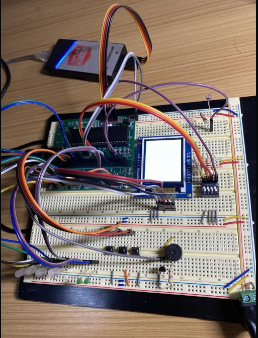
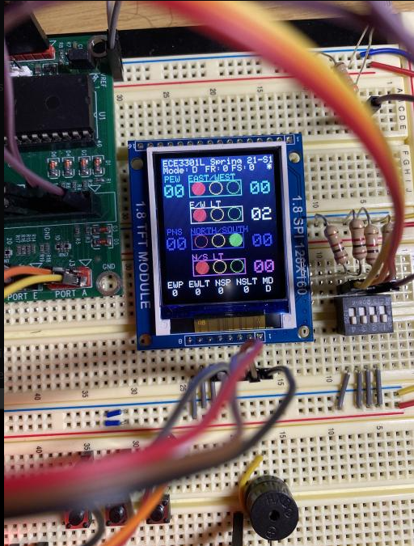
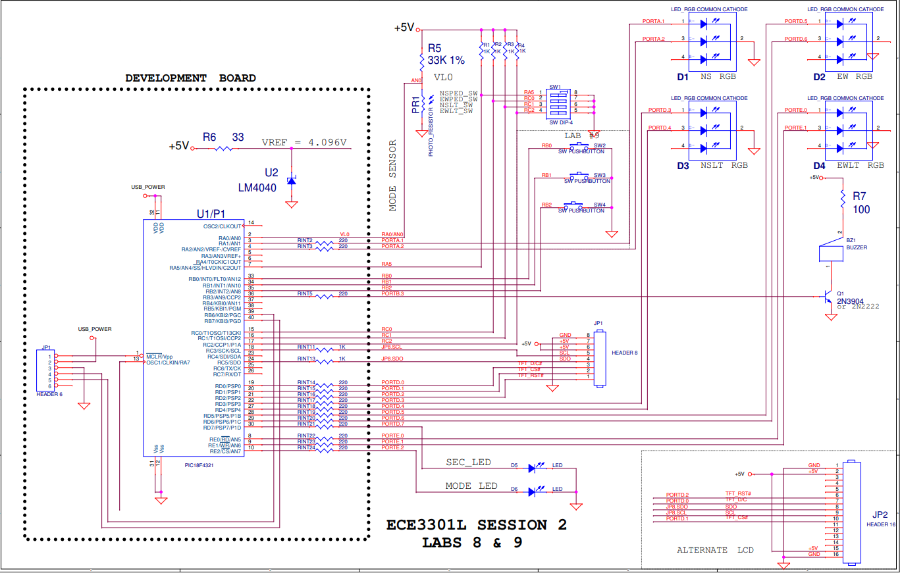

# Traffic Light Simulator

## Project Description
<br/> This course project was built in response to an Introduction to Microcontroller course. The application showcases the language of C and the PIC18F series microcontroller.  </br>

<br/>The traffic light simulator provides a systematic understanding of how a real life traffic light would function and is reflected on a TFT display. The simulator uses dip switches to simulate car waiting in a particular direction (North and South,  East and West, East West Left Turn, North South Left Turn). Furthermore, the simulator provides a functional pedestrian crossing the road to allow pedestrian to cross the road based on LED and timer displayed on the LCD. Each traffic light in the particular direction will have a specific time for each direction as well as a specified mode called Day and Night mode and it is determined using a photo sensor. Night mode will be enabled when no light is detected and will shut off all Pedestrian access. Lastly, if a traffic light malfunctions, it will operate under emergency mode in which all directions of the traffic light will be flashing red to notify drivers to follow the guidelines of a 4-way traffic stop. </br>

### Hardware Used
- PIC18F4820 microcontroller development board
- MPLAB PICkit 4
- ST7735 TFT LCD Display
- RGB LED
- LED
- Photo sensor
- Buzzer
- 2n2222 BJT
- 4-position DIP switch
- push buttons

### Software Used 
- MPLAB X IDE v4.20 was used to program the PICkit4 in order to debug the hardware and software for the pic18f4820 microcontroller. The code was built using C and can be found in the path ```Code/Lab9.c```
- Concepts used for this project to work: Implementation of LCD, System Timer, External Interrupts, and Logic of Traffic Lights
  - The implementation of the LCD is to shows the user how the traffic light operates under a particular circumstance and is useful for debugging purposes as it allows a visual display to troubleshoot. It is implemented by utilizing a created TFT C file located in ```Code/ST7735_TFT.c``` that provides functions to create the graphics for the traffic light. 
  - a System timer is used by utilizing the INT0CON, T0CON, TMRL, and TMRH registers to generate a time of 1 second. 
  - An external interrupt is used to generate the emergency mode when a traffic light malfunctions.
  - Logic of a Traffic light is needed to built a safe and real-time operating traffic light. 

# Setup


# LCD display of the simulator


## Circuit Schematic

